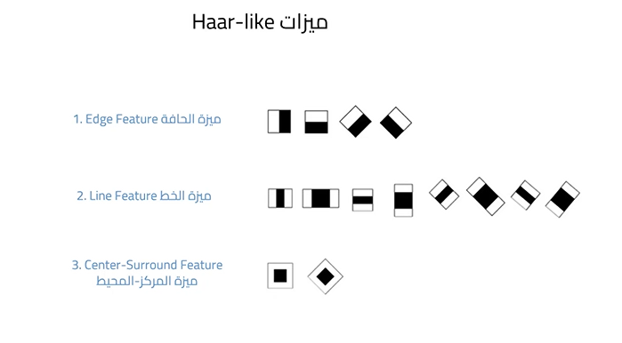

# 🖼️ Digital Image Processing & Face Detection using OpenCV

This project demonstrates fundamental image processing operations and
classical face detection techniques using Python and OpenCV in Google Colab.

The goal of this project is to understand how digital images are
manipulated and how computer vision algorithms detect human faces in
images.

------------------------------------------------------------------------

# 📌 Topics Covered

## 1️⃣ Image Resizing

Resizing is an essential operation in digital image processing. Images
often need to be resized to:

-   Improve performance
-   Reduce memory usage
-   Prepare data for machine learning models
-   Adjust display dimensions

### Key Concepts

-   Direct resizing may distort the image.
-   Aspect ratio must be preserved to avoid stretching.
-   Scaling factor maintains correct width-to-height proportions.
-   The imutils library simplifies resizing while preserving aspect
    ratio.

------------------------------------------------------------------------

## 2️⃣ Image Rotation

Image rotation is used for:

-   Orientation correction
-   Visual effects
-   Geometric transformations

### Key Concepts

-   Rotation is performed around the center of the image.
-   A rotation matrix defines angle and scaling.
-   Clockwise rotation uses negative angles.
-   warpAffine() applies affine transformation.
-   rotate_bound() prevents cropping after rotation.

------------------------------------------------------------------------

## 3️⃣ Face Detection using Haar Cascades

Face detection is the process of identifying and locating human faces in
images.

Important:\
Face Detection is different from Face Recognition.\
This project detects faces but does not identify individuals.

------------------------------------------------------------------------

# 🧠 Haar Cascade Classifier

This project uses the classical Haar Cascade algorithm provided by
OpenCV.

### How It Works

-   Converts image to grayscale
-   Uses Haar-like features to measure intensity differences
-   Applies a cascade of classifiers
-   Uses a sliding window approach
-   Filters non-face regions in multiple stages

------------------------------------------------------------------------

## Haar-like Features

The algorithm uses rectangular feature comparisons such as:

-   Edge features\
-   Line features\
-   Center-surround features

These features detect patterns commonly found in faces like eyes, nose,
and forehead regions.

------------------------------------------------------------------------

## Cascade Classifier

The detection process works in stages:

1.  Simple filters reject obvious non-faces\
2.  More complex filters refine detection\
3.  Only strong candidates remain

This makes the method:

-   Fast
-   Efficient
-   Suitable for real-time applications

------------------------------------------------------------------------

## Important Detection Parameters

-   scaleFactor → Controls image scaling during detection\
-   minNeighbors → Controls detection quality and reduces false
    positives\
-   minSize → Sets minimum detectable face size

Model used: - haarcascade_frontalface_default.xml (detects frontal faces
only)

------------------------------------------------------------------------

# 🛠️ Technologies Used

-   Python\
-   OpenCV\
-   NumPy\
-   imutils\
-   Google Colab

------------------------------------------------------------------------

# 📂 Project Workflow

1.  Load image\
2.  Inspect dimensions\
3.  Convert to grayscale\
4.  Apply Haar Cascade classifier\
5.  Detect face coordinates\
6.  Draw bounding boxes\
7.  Display final result
