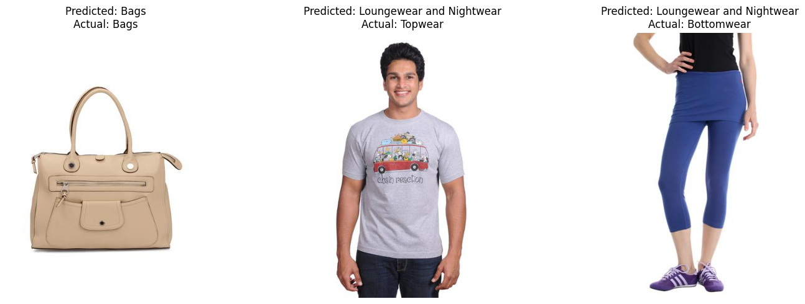
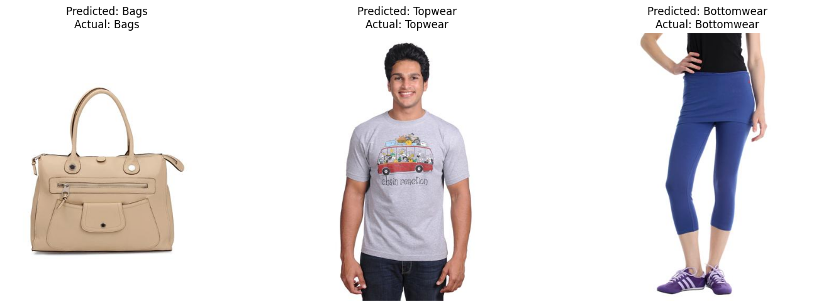

# 🎯 Fine-Tuning in Computer Vision (CLIP & ViT)
## 📌 Overview

Fine-tuning is a fundamental technique in deep learning, especially in computer vision.
Instead of training models from scratch, we start with pretrained models and adapt them to our specific task.
---

# 🧵 Project 1: CLIP Fine-Tuning for Fashion Classification

## 📌 Description

In this project, we fine-tuned a pretrained CLIP model to classify fashion products into specific subcategories.

CLIP was originally trained to connect images and text, but here we adapted it for a **custom classification task**.

---

## 🎯 Objective

* Improve classification accuracy on fashion images
* Adapt CLIP to a domain-specific dataset
* Understand how feature extraction works

---

## 🗂 Dataset

* **Name:** Fashion Products Dataset
* Contains:

  * Product images
  * Subcategory labels (e.g., shirts, shoes, bags)

---

## ⚙️ Approach

### Step 1 — Load Pretrained Model

* Used CLIP (ViT-B/32)

### Step 2 — Extract Features

* Image encoder → feature vector
* Text encoder → label embeddings

### Step 3 — Add Classifier

* Added a linear layer:

```python
nn.Linear(model.visual.output_dim, num_classes)
```

### Step 4 — Fine-Tuning

* Froze CLIP backbone
* Trained only classifier layer

---

## 🧠 Key Concepts Learned

* Feature extraction
* Cosine similarity
* Embedding normalization
* Transfer learning

---

## 📊 Results

* Before fine-tuning:

  * Model made incorrect predictions



* After fine-tuning:

  * Improved classification accuracy
  * Better alignment with dataset labels



---

## 📈 Observations

* CLIP performs well even before training
* Fine-tuning improves domain-specific accuracy
* Works best when labels are clear and consistent

---

# 🌱 Project 2: ViT Fine-Tuning for Plant Disease Classification

## 📌 Description

In this project, we fine-tuned a Vision Transformer (ViT) model to classify plant leaf diseases.

---

## 🎯 Objective

* Classify plant leaves into:

  * Angular Leaf Spot
  * Bean Rust
  * Healthy

---

## 🗂 Dataset

* **Name:** Beans Dataset
* Includes:

  * Leaf images
  * Disease labels

---

## ⚙️ Approach

### Step 1 — Load Model

* ViT (Vision Transformer)

### Step 2 — Preprocess Data

* Resize images
* Normalize
* Convert to tensors

---

### Step 3 — Training

Used HuggingFace Trainer API:

* Defined training arguments
* Used batches and epochs
* Applied evaluation steps

---

### Step 4 — Evaluation

* Used accuracy metric
* Compared predictions with true labels

---

## 🧠 Key Concepts Learned

* Transformer-based vision models
* Dataset transformation
* Trainer API
* Model evaluation

---

## 📊 Results

* Before fine-tuning:

  * Model predicted incorrect classes (e.g., random objects)

* After fine-tuning:

  * High accuracy on plant disease classification
  * Correct predictions on unseen images

---

## 📈 Observations

* ViT is very powerful for classification
* Needs proper preprocessing
* Works better with structured datasets

---

# 📌 Final Comparison

| Model | Strength                        | Weakness                           |
| ----- | ------------------------------- | ---------------------------------- |
| CLIP  | Works with text + image         | Not specialized for classification |
| ViT   | High accuracy in classification | Needs fine-tuning                  |

---

# 🚀 Final Takeaways

* Fine-tuning significantly improves model performance
* Pretrained models save time and resources
* Understanding the pipeline is more important than just coding

---
