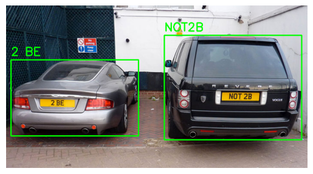

# 🚗 Automatic Number Plate Recognition (ANPR)

## 📌 Overview

This project implements an **Automatic Number Plate Recognition (ANPR)** system using computer vision and deep learning techniques.

The system detects vehicle license plates from images and extracts the text (plate number) automatically.

---

## 🎯 Objectives

* Detect car license plates from images
* Extract plate region accurately
* Recognize characters from the plate
* Build a complete end-to-end pipeline

---

## 🧠 What is ANPR?

Automatic Number Plate Recognition (ANPR) is a computer vision system that:

1. Detects vehicles or license plates
2. Segments the plate region
3. Recognizes the text on the plate

---

## ⚙️ System Pipeline

The system follows these steps:

1️⃣ Image Input
2️⃣ Preprocessing
3️⃣ Plate Detection
4️⃣ Plate Cropping
5️⃣ Text Recognition (OCR)
6️⃣ Output Plate Number

---

## 🧩 Technologies Used

* Python
* OpenCV
* Deep Learning / Computer Vision
* OCR (Optical Character Recognition)

---

## 🔍 Methodology

### 1. Image Preprocessing

* Convert image to grayscale
* Reduce noise
* Enhance edges

👉 Improves detection accuracy

---

### 2. Plate Detection

Techniques used:

* Edge detection
* Contour detection
* Bounding boxes

👉 Goal: locate the license plate in the image

---

### 3. Plate Extraction

* Crop the detected region
* Focus only on the plate

---

### 4. Character Recognition (OCR)

* Extract text from the plate
* Convert image → string

---

## 🖼 Sample Results

👉 Add your outputs here:

---
