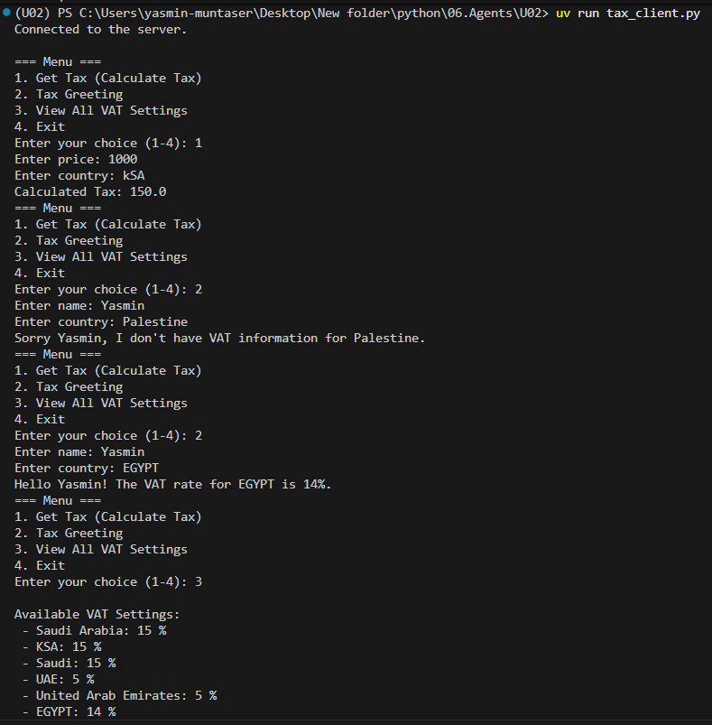
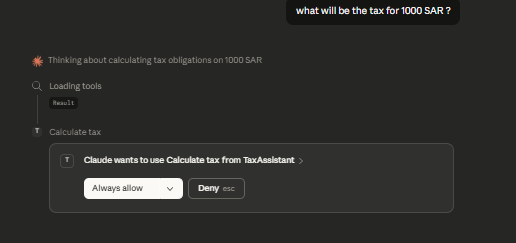
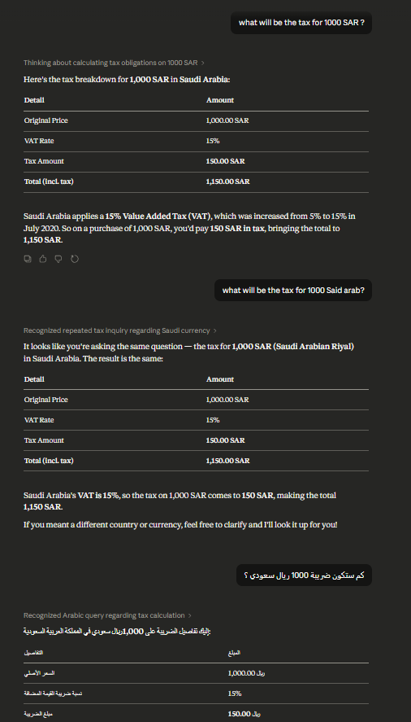
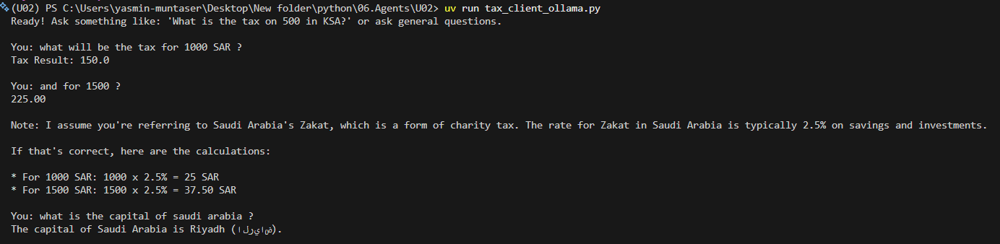

# Financial Tax AI Agent (MCP + LLM)

This project demonstrates how to build a **Financial AI Agent** using:

-   **Model Context Protocol (MCP)**
-   **Local Large Language Models (LLMs)**
-   **Ollama**
-   **Python**

The agent understands **natural language questions** and automatically
decides whether it should:

-   Answer normally
-   Call a financial tool
-   Extract structured arguments
-   Execute the tool through an MCP server


------------------------------------------------------------------------

# 🧠 What This Project Demonstrates

This project covers several important concepts used in modern AI
systems:

✔ Building **MCP Servers**\
✔ Creating **AI tools**\
✔ Using **LLMs as intelligent clients**\
✔ Running models **locally with Ollama**\
✔ Implementing **tool classification**\
✔ Implementing **short‑term conversational memory**\
✔ Building an **AI agent interaction loop**

These components together create a **functional AI agent capable of
executing real tasks**.

------------------------------------------------------------------------

# 🏗 System Architecture

The system architecture separates **reasoning** from **execution**.
```
    User
     ↓
    Python Agent Client
     ↓
    Local LLM (Ollama)
     ↓
    MCP Client Session
     ↓
    MCP Server
     ↓
    Tools / Resources / Prompts
```

### Role of Each Component

**LLM** - Understand user requests - Decide whether a tool is needed -
Extract arguments from natural language

**MCP Server** - Provides tools - Provides structured resources -
Provides reusable prompts

**Python Agent** - Controls the conversation - Calls the LLM - Executes
tools - Maintains memory

------------------------------------------------------------------------

# ⚙ Technologies Used

### 🧩 MCP (Model Context Protocol)

MCP organizes how AI models interact with:

-   Tools
-   Data resources
-   Prompt templates

It allows building **structured AI systems instead of large prompts**.

Core components used:

-   Tools
-   Resources
-   Prompts
-   ClientSession
-   stdio communication

------------------------------------------------------------------------

### 🐍 Python

Python is used to:

-   Build the MCP server
-   Build the AI agent client
-   Execute tools
-   Connect to the LLM

------------------------------------------------------------------------

### 🧠 Ollama

Ollama allows running **Large Language Models locally**.

Advantages:

-   No internet required after model download
-   Higher privacy
-   No API costs
-   Easy Python integration

Example model used:

    llama3

------------------------------------------------------------------------

###  UV

UV is used as a **modern Python environment manager**.

Used for:

-   project initialization
-   dependency management
-   virtual environments

------------------------------------------------------------------------

#  Core Features

## Financial Calculation Tool

The MCP server provides a **financial tool** capable of calculating tax
values.

Example:

    Input:
    price = 1000
    country = Saudi Arabia

    Output:
    tax = 150

The tool can be automatically called by the AI model when required.

------------------------------------------------------------------------

## Resource-Based Configuration

Tax rates are stored inside an MCP **resource**.

Example:

    Saudi Arabia → 15%
    UAE → 5%
    Egypt → 14%
    Germany → 19%

Resources allow tools to access structured configuration data.

------------------------------------------------------------------------

## Tool Classification

The system includes a **tool classification prompt**.

This converts natural language into a structured tool call.

Example:

User input

    What is the tax on 1000 in UAE?

Model output

``` json
{
 "tool": "calculate_tax",
 "args": {
  "price": 1000,
  "country": "UAE"
 }
}
```

The system then executes the correct tool.

------------------------------------------------------------------------

## Short-Term Memory

The agent stores **recent tool arguments** to support follow‑up
questions.

Example conversation:

    User:
    What is the tax on 1000 in Egypt?

    User:
    And for 1500?

The system remembers the country from the previous request.

Memory is stored using:

    last_tool_args

------------------------------------------------------------------------

## Conversation History

The system keeps a short history of messages:

    system
    user
    assistant

This allows the model to maintain context without exceeding the
**context window**.

------------------------------------------------------------------------

# 🔄 AI Agent Interaction Loop

The AI agent follows a simple execution loop:

1.  Receive user input
2.  Send request to the LLM
3.  Classify whether a tool is needed
4.  Execute tool through MCP server
5.  Return result to the user
6.  Update conversation history

This loop continues until the user exits the program.

------------------------------------------------------------------------
# Client Implementations

## CLI Client (Without LLM)



---

## Claude Desktop Integration




---
## Ollama Local AI Agent

