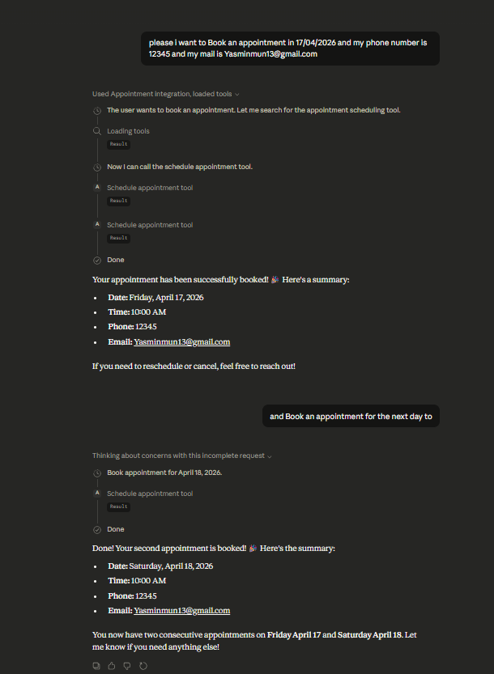
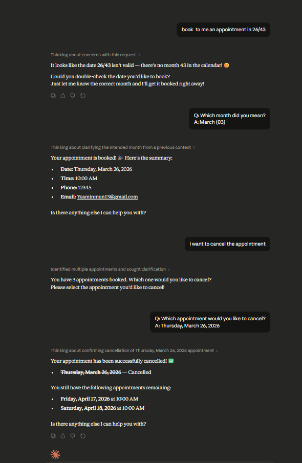
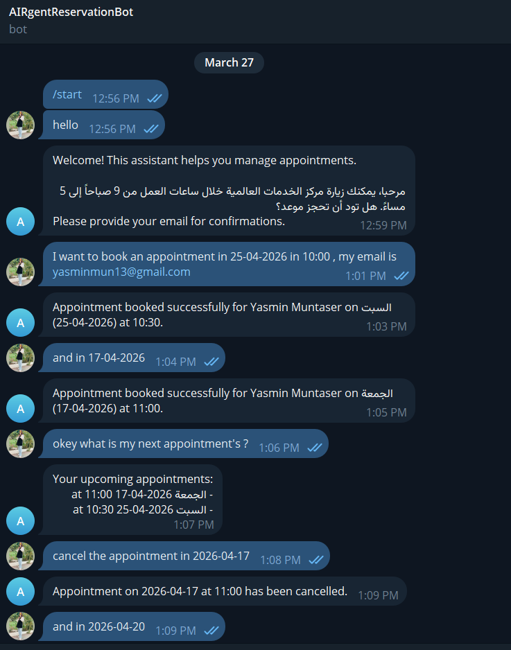
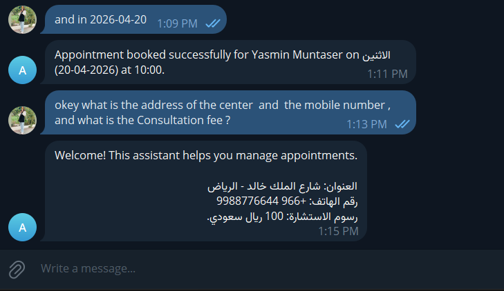
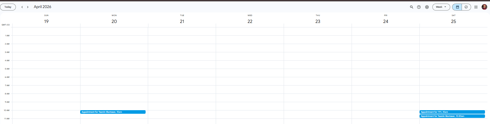
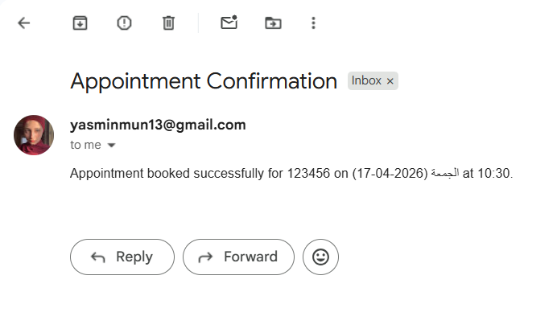

# Smart Appointment Assistant

## 1. Introduction
The **Smart Appointment Assistant** is an AI-powered agent designed to help users manage appointments efficiently.  
It can:
- Schedule an appointment on a specific date and provide confirmation or rejection if no slots are available.
- Cancel previous appointments.
- View all upcoming appointments.
- Answer general questions about the center (e.g., location, services, prices).
- Send confirmation emails for appointments, cancellations, and reminders.

---

## 2. Features
- **Appointment Scheduling** with Google Calendar integration.
- **Appointment Cancellation**.
- **View Upcoming Appointments**.
- **Email Notifications** via Gmail (confirmation, cancellation, reminders).
- **AI-driven responses** for general queries.
- **Integration with WhatsApp (Twilio API)** and Telegram.
- Local AI support via **Ollama LLM (Llama3.1-8b-local)**.

---

## 3. Requirements
- Python 3.10+
- Python libraries:
  - `mcp`, `google-api-python-client`, `oauth2client`, `psycopg2-binary`, `python-dotenv`, `requests`, `ollama`
- Database: **Supabase** (alternative to PostgreSQL)
- Google account for Calendar & Gmail API
- Ngrok for public webhook URL
- Twilio Sandbox or Meta Cloud API for WhatsApp
- Telegram bot token (optional)

---

## 4. Database Setup
Use Supabase to store customer and appointment data:

- **Tables:**
  - `Customers`: phone, email
  - `Appointments`: phone, date, time, status
  - `Conversations`: phone, sender (user/assistant), message, timestamp

- Implement Python helper functions:
  - `add_or_update_customer()`
  - `add_appointment()`, `cancel_appointment()`, `get_appointments()`
  - `log_conversation()`

---

## 5. Gmail / Email Setup
1. Create a Gmail account or use an existing one.
2. Enable SMTP and generate app password if using Gmail.
3. Add credentials in `.env`:
```env
EMAIL_FROM=example@gmail.com
EMAIL_PASSWORD=app_password
SMTP_SERVER=smtp.gmail.com
SMTP_PORT=587
```
4. Use the Python email functions to send:
  - Appointment confirmation
  - Cancellation notices
  - Appointment reminders

---

## 6. Google Calendar Setup
1. Create a Google Cloud project.
2. Enable **Google Calendar API**.
3. Download `credentials.json` and store in the project folder.
4. Generate OAuth token (`token.json`) to authorize API access.
5. Use Python calendar functions to:
  - Schedule appointments
  - Cancel appointments
  - Retrieve upcoming appointments

---

## 7. MCP Server and Tools
The project uses **FastMCP** to expose tools/resources for the AI agent.

### Available Tools
| Tool | Function |
|------|---------|
| `schedule_appointment_tool` | Schedule an appointment, send email, log conversation |
| `cancel_appointment_tool` | Cancel appointment, send email, log conversation |
| `get_appointments_tool` | Retrieve appointments, send email if needed |
| `default_response` | Respond to general queries or unclear messages |

---

## 8. WhatsApp & Telegram Integration
- **WhatsApp API Options:**
  1. Twilio WhatsApp API (currently used)
  2. Meta Cloud API (requires payment, advanced setup)

- **Telegram Bot:**
  - Use Telegram bot token to receive and respond to messages.

- Messages flow:
```
User → MCP server → Tool classification → Update DB/Calendar/Email → Response
```

---

## Claude Desktop Integration



## Telegram bot



## whatsapp bot

## Google Calender



## Email Confirmations



